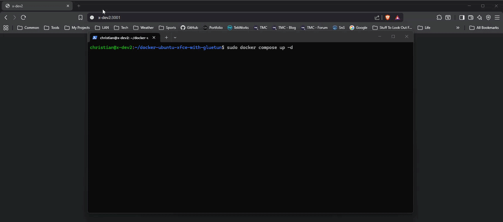

A [Docker](https://www.docker.com/) [Compose](https://docs.docker.com/compose/) stack to deploy an **isolated**, *VPN-routed* Linux desktop environment using [Webtop](https://github.com/linuxserver/docker-webtop) and [Gluetun](https://github.com/qdm12/gluetun) VPN! 



Access the desktop environment through a web browser and all traffic from the desktop is routed through the VPN connection. The desktop environment will only start after the VPN connection is established and healthy, ensuring that all desktop traffic is routed securely through the VPN.

## Setup
Out of the box, the Ubuntu XFCE desktop environment is used and Gluetun is configured to use [NordVPN](https://nordvpn.com/) with [OpenVPN](https://openvpn.net/). You should be able to use any VPN provider supported by Gluetun.

The desktop environment comes with some apps, a web browser (Chromium), and a terminal pre-installed. You can install additional apps as needed inside of the [`Dockerfile`](./Dockerfile), but additional configuration may be needed!

Run the following commands to get started:

1. Clone this repository and navigate to the project directory.
    ```bash
    # Clone the repository
    git clone https://github.com/gamemann/docker-webtop-with-gluetun-vpn

    # Navigate to the project directory
    cd  docker-webtop-with-gluetun-vpn
    ```
2. Run the [`setup.sh`](./setup.sh) script to create the necessary directories for persistent data and copy the example environment files to their respective `.env` files.
    * You may need to give the script execute permissions with `chmod +x setup.sh` if you haven't already.
    * If you can't run the script, you can manually create the directories and copy the example environment files to their respective `.env` files:
        * **The env files are**: `.env` (Docker Compose settings), `.env.gluetun` (Gluetun VPN settings), and `.env.desktop` (Webtop desktop settings).
        * **The persistent directories are**: `./config` (Webtop user data and settings) and `./gluetun` (Gluetun VPN configuration).
    ```bash
    # Give the setup script execute permissions (if needed)
    chmod +x setup.sh

    # Run the setup script
    ./setup.sh
    ```
3. Change the values in the `.env.gluetun` file to match your VPN provider and credentials. You can also change the values in the `.env.desktop` file to customize the Webtop desktop environment.
    * You can try different desktop images by changing the `IMG_DESKTOP_TAG` value in the `.env` file. Just keep in mind if you're switching from the `apt` package manager, you will need to adjust the install commands in the [`Dockerfile`](./Dockerfile) to match the package manager of the new base image.
4. Start the Docker Compose project.
    ```bash
    # Start the containers and attach. You can hit the 'd' key to detach and leave them running in the background.
    docker compose up

    # Start and detach the containers.
    docker compose up -d

    # View log output for the containers and follow along.
    docker compose logs -f
    ```
    * I recommend removing the `-d` flag for the first run so you can see the logs and ensure everything is working correctly. Once you're confident it's working, you can add the `-d` flag to run in detached mode. You can also detach by hitting the `d` key (in newer versions of Docker Compose at least).
5. Access the Webtop desktop environment by navigating to `https://<hostname/ip>:3001`.

## Used Environment Variables (Configuration)
### Docker Compose Settings (`.env`)
| Variable | Description | Default Value |
|----------|-------------| ------------- |
| `IMG_GLUETUN_TAG` | The Gluetun image tag to use. You can change this to a specific version if you want to lock it down, e.g. `3.21.0`. | `latest` |
| `IMG_DESKTOP_TAG` | The Webtop desktop image tag to use. You can change this to a specific version if you want to lock it down, e.g. `ubuntu-kde`. | `ubuntu-xfce` |
| `GLUETUN_BIND_ADDR` | The bind address for the Webtop interface through Gluetun. You can change this to `localhost` if you're running this locally and don't want to expose the Webtop interface to your network. | `0.0.0.0` |
| `DESKTOP_HTTP_PORT` | The HTTP port for the Webtop interface. | `3000` |
| `DESKTOP_HTTPS_PORT` | The HTTPS port for the Webtop interface. | `3001` |

### Gluetun VPN Settings (`.env.gluetun`)
| Variable | Description | Default Value |
|----------|-------------| ------------- |
| `VPN_SERVICE_PROVIDER` | The VPN service provider to use. You can change this to any provider supported by Gluetun. | `nordvpn` |
| `VPN_TYPE` | The VPN protocol to use. You can change this to any protocol supported by your VPN provider. | `openvpn` |
| `OPENVPN_USER` | The username for your VPN account. | - |
| `OPENVPN_PASSWORD` | The password for your VPN account. | - |
| `SERVER_COUNTRIES` | The country to connect to. You can change this to any country supported by your VPN provider. | `United States` |
| `FIREWALL_OUTBOUND_SUBNETS` | The subnets to allow outbound traffic to. You may have to change this to match your local network configuration! | `192.168.1.0/24` |

### Desktop Settings (`.env.desktop`)
| Variable | Description | Default Value |
|----------|-------------| ------------- |
| `PUID` | The user ID for the Webtop desktop environment. | `1000` |
| `PGID` | The group ID for the Webtop desktop environment. | `1000` |
| `TZ` | The timezone to use for the Webtop desktop environment. | `America/New_York` |
| `TITLE` | The title of the Webtop desktop window. | `Ubuntu Gluetun Desktop` |
| `CUSTOM_USER` | The username for the Webtop desktop environment. | `user` |
| `PASSWORD` | The password for the Webtop desktop environment. | `password` |

### Environmental Notes
* You can remove `$CUSTOM_USER` and `$PASSWORD` variables from the environment file to disable authentication for the Webtop desktop environment, but I don't recommend that if you're exposing the Webtop to a network you don't fully trust.
* You can set additional environmental variables in the desktop and Gluetun containers by adding them to the respective `.env` files. You can find a list of available environmental variables for Gluetun [here](https://github.com/passteque/gluetun/blob/master/Dockerfile#L80) (documentation [here](https://github.com/qdm12/gluetun-wiki/tree/main/setup/options)). Documentation for the Webtop desktop environment can be found [here](https://github.com/linuxserver/docker-webtop).

## Final Notes
* There were some additional configuration I needed to apply in order to get everything working including launching Chromium inside of the desktop environment (the default web browser in the Webtop image).
* From everything I read, Gluetun operates as a [*kill switch*](https://protonvpn.com/support/what-is-kill-switch) by default, meaning that if the VPN connection goes down, all traffic from the desktop container will be blocked until the VPN connection is re-established. This is a great security feature to prevent accidental leaks of unencrypted traffic.
* If you're trying to set this up with NordVPN, I suggest using [service credentials](https://support.nordvpn.com/hc/en-us/articles/19685514639633-Changes-to-the-login-process-on-third-party-apps-and-routers) as the username and password for the OpenVPN connection. You can generate these credentials in your NordVPN account settings. This is a more secure way to authenticate with NordVPN than using your regular account credentials.