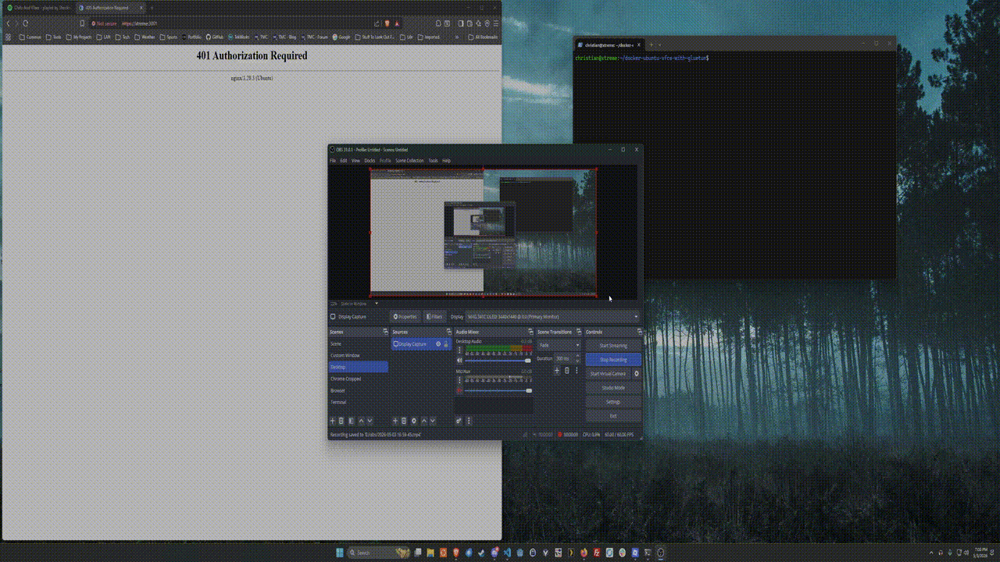

A Docker Compose setup for running an Ubuntu XFCE desktop environment using [Webtop](https://github.com/linuxserver/docker-webtop) with [Gluetun](https://github.com/qdm12/gluetun) VPN! In this setup, I utilize [NordVPN](https://nordvpn.com/) with [OpenVPN](https://openvpn.net/), but you should be able to use any VPN provider supported by Gluetun. The Webtop desktop environment is configured to only start after the VPN connection is established and healthy, ensuring that all desktop traffic is routed securely through the VPN.

The configuration files in this repository include comments to assist with setup!

Enjoy your secure, containerized desktop environment!

## Setup
1. Clone this repository and navigate to the project directory.
2. Update the [`docker-compose.yml`](./docker-compose.yml) file with your VPN credentials and any other desired configuration changes (see comments in the file for details).
3. Run [`setup.sh`](./setup.sh) to create the necessary directories for persistent data.
    * You may need to give the script execute permissions with `chmod +x setup.sh` if you haven't already.
4. Start the containers with `docker-compose up -d`.
    * I recommend removing the `-d` flag for the first run so you can see the logs and ensure everything is working correctly. Once you're confident it's working, you can add the `-d` flag to run in detached mode. You can also detach by hitting the `d` key (in newer versions of Docker Compose at least).
5. Access the Webtop desktop environment by navigating to `https://<hostname/ip>:3001`.

## Notes
* There were some additional configuration I needed to apply in order to get everything working including launching Chromium inside of the desktop environment (the default web browser in the Webtop image).
* From everything I read, Gluetun operates as a [*kill switch*](https://protonvpn.com/support/what-is-kill-switch) by default, meaning that if the VPN connection goes down, all traffic from the desktop container will be blocked until the VPN connection is re-established. This is a great security feature to prevent accidental leaks of unencrypted traffic.